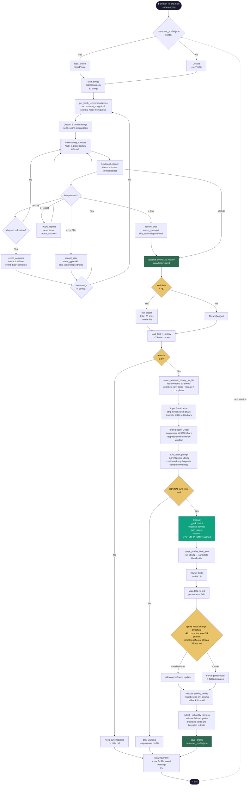

# Pipeline

```mermaid
flowchart TD
    %% ── SESSION START ──────────────────────────────────────────
    A([▶ python -m src.main\n--now-playing]) --> B{data/user_profile.json\nexists?}
    B -- Yes --> C[load_profile\nUserProfile]
    B -- No --> D[Default\nUserProfile]
    C --> E[load_songs\ndata/songs.csv\n80 songs]
    D --> E

    %% ── RECOMMENDATION ─────────────────────────────────────────
    E --> F[get_fresh_recommendations\nrecommend_songs k=8\nscoring_mode from profile]
    F --> G[Queue: 8 ranked songs\nsong, score, explanation]

    %% ── PLAYBACK LOOP ──────────────────────────────────────────
    G --> H[NowPlayingUI.render\nANSI in-place redraw\n0.5s tick]
    H --> I[KeyboardListener\ndaemon thread\ntermios/select]

    I --> J{key pressed?}
    J -- no key --> K{elapsed ≥ duration?}
    K -- No --> H
    K -- Yes --> L[record_complete\nInteractionEvent\nevent_type=complete]
    L --> M{more songs\nin queue?}
    M -- Yes --> H
    M -- No --> F

    J -- r Repeat --> N[record_repeat\nreset timer\nrepeat_count++]
    N --> H

    J -- s / → Skip --> O[record_skip\nevent_type=skip\nskip_ratio=elapsed/total]
    O --> M

    J -- q Quit --> P[record_skip\nevent_type=quit\nskip_ratio=elapsed/total]

    %% ── ON QUIT ─────────────────────────────────────────────────
    P --> Q[append_events_to_history\ndata/history.jsonl]
    Q --> R{total lines\n> 75?}
    R -- Yes --> S[trim oldest\ntotal−75 lines\nrewrite file]
    R -- No --> T[file unchanged]
    S --> U[load_last_n_history\nn=75 most recent]
    T --> U

    %% ── LIGHTWEIGHT RAG ─────────────────────────────────────────
    U --> V{events\n≥ 5?}
    V -- No --> W[Keep current profile\nno LLM call]
    V -- Yes --> X[select_relevant_history_for_llm\nretrieve up to 20 events\nprioritize early skips / repeats / completes]
    X --> Y[Input Sanitization\nstrip newlines/ctrl chars\ntruncate fields to 80 chars]
    Y --> Z[Token Budget Check\ncap prompt at 3000 chars\nkeep retrieved evidence window]
    Z --> ZA[build_user_prompt\ncurrent profile JSON\n+ retrieved skip / repeat / complete evidence]

    %% ── LLM ─────────────────────────────────────────────────────
    ZA --> AA{OPENAI_API_KEY\nset?}
    AA -- No --> AB[print warning\nkeep current profile]
    AA -- Yes --> AC[OpenAI\ngpt-4.1-mini\nresponse_format: json_object\nsystem: SYSTEM_PROMPT cached]
    AC --> AD[parse_profile_from_json\nraw JSON → candidate UserProfile]

    %% ── RELIABILITY LAYER ───────────────────────────────────────
    AD --> AE[Clamp floats\nto 0.0-1.0]
    AE --> AF[Max delta +/-0.3\nper numeric field]
    AF --> AG{genre mood change threshold\nskip current at least 35 percent\ncomplete different at least 35 percent}
    AG -- threshold met --> AH[Allow genre/mood update]
    AG -- not met --> AI[Force genre/mood\n= fallback values]
    AH --> AJ[Validate scoring_mode\nmust be one of 4 enums\nfallback if invalid]
    AI --> AJ
    AJ --> AKA[pytest + reliability harness\nvalidate fallback paths\nprotected fields and bounded outputs]

    %% ── SAVE & EXIT ─────────────────────────────────────────────
    AKA --> AK[save_profile\ndata/user_profile.json]
    W --> AL
    AB --> AL
    AK --> AL[NowPlayingUI\nshow Profile saved message\n2s]
    AL --> AM([✓ Exit])

    %% ── CTRL+C PATH ─────────────────────────────────────────────
    I -- Ctrl+C --> Q

    %% ── NEXT SESSION ────────────────────────────────────────────
    AM -.->|next session| B

    %% ── STYLING ─────────────────────────────────────────────────
    style A fill:#1a1a2e,color:#eee
    style AM fill:#1a1a2e,color:#eee
    style AC fill:#10a37f,color:#fff
    style Q fill:#2d6a4f,color:#fff
    style AK fill:#2d6a4f,color:#fff
    style R fill:#e9c46a,color:#000
    style V fill:#e9c46a,color:#000
    style AG fill:#e9c46a,color:#000
    style AA fill:#e9c46a,color:#000
```
