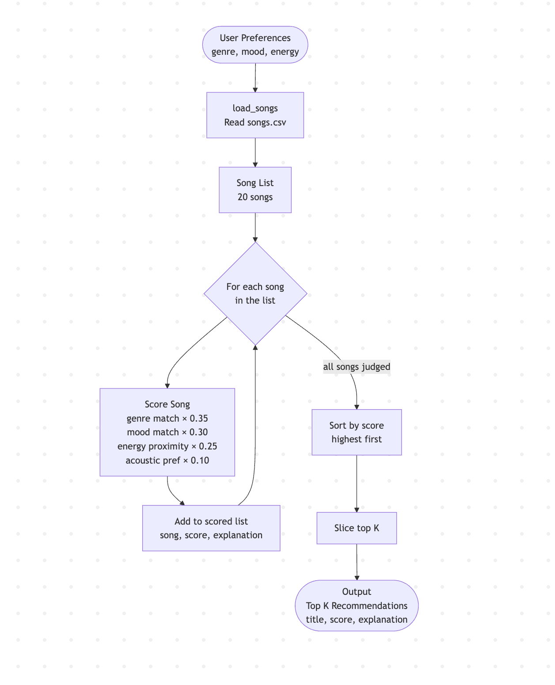
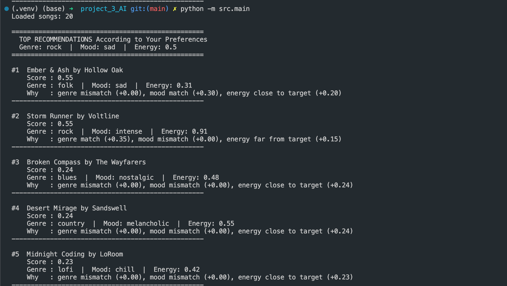
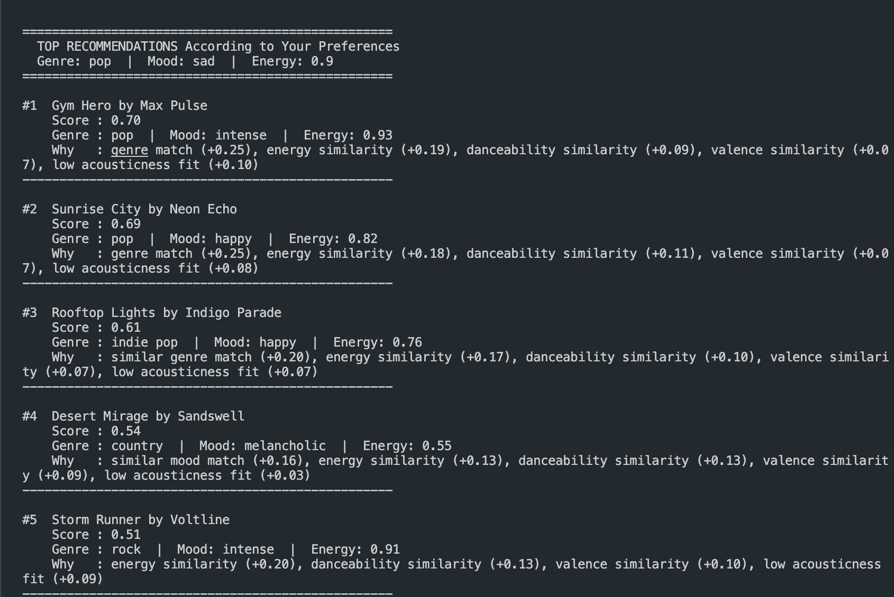
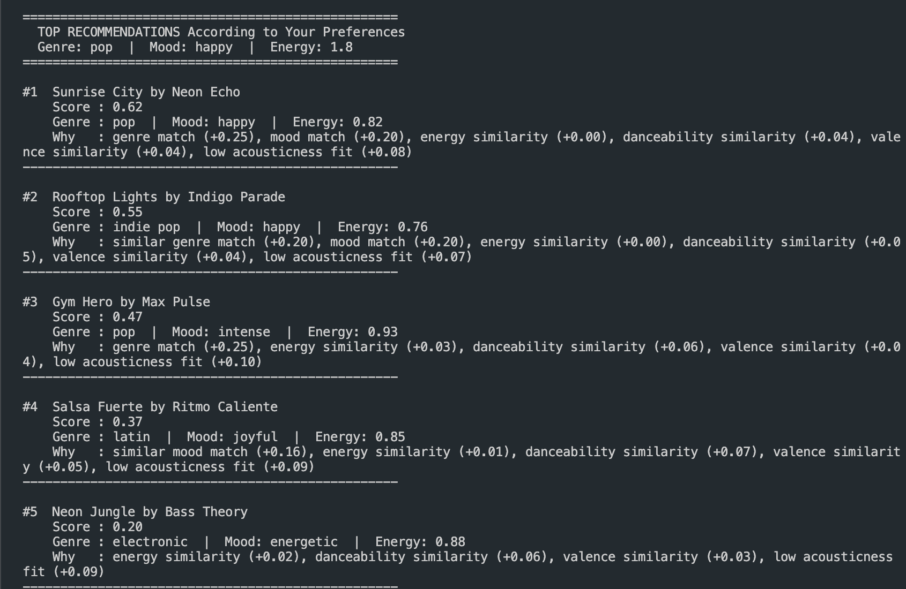
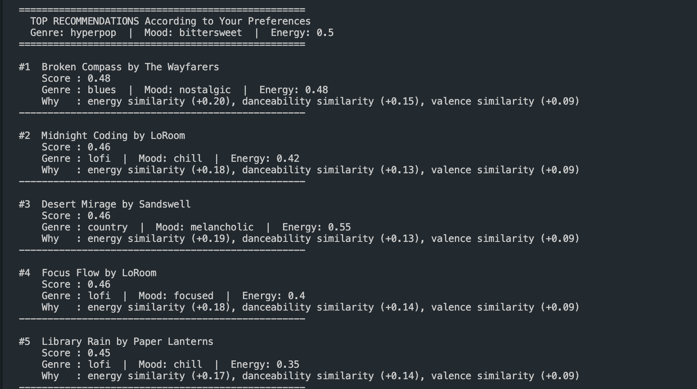

# 🎵 Music Recommender Simulation

## Project Summary

In this project you will build and explain a small music recommender system.

Your goal is to:

- Represent songs and a user "taste profile" as data
- Design a scoring rule that turns that data into recommendations
- Evaluate what your system gets right and wrong
- Reflect on how this mirrors real world AI recommenders

Replace this paragraph with your own summary of what your version does.

---

## How The System Works

Explain your design in plain language.

According to what I research and the data that is provided it would be the best to use the content based recommendations.

Some prompts to answer:

- What features does each `Song` use in your system
  - For example: genre, mood, energy, tempo

  For the system, each song uses genre and mood as the main categorical features. It also uses energy, valence, danceability, and acousticness as the main numerical features when ranking songs.

- What information does your `UserProfile` store
  - genre, mood, target energy, target danceability, target valence, acoustic preference, and optional favorite artist

- How does your `Recommender` compute a score for each song
  - It computes a weighted score based on similarity between the song's features and the user's preferences. Exact genre and mood matches help the most, but the system also compares energy, danceability, valence, and acousticness.
- How do you choose which songs to recommend
  - When the recommender receives the user's preferences and the songs.csv file, it computes a total score for each song and sorts them from highest to lowest. Genre, mood, and energy are still important, but the final ranking is improved by danceability, valence, acousticness, and artist preference when provided.
You can include a simple diagram or bullet list if helpful.


-Potential Biases:
    The system now includes a small genre similarity map, so related genres such as pop and indie pop can receive partial credit. However, this is still a hand-written rule, so it reflects my assumptions and may miss other genre relationships.




---

## Getting Started

### Setup

1. Create a virtual environment (optional but recommended):

   ```bash
   python -m venv .venv
   source .venv/bin/activate      # Mac or Linux
   .venv\Scripts\activate         # Windows

2. Install dependencies

```bash
pip install -r requirements.txt
```

3. Run the app:

```bash

python -m src.main
```

### Running Tests

Run the starter tests with:

```bash
pytest
```

You can add more tests in `tests/test_recommender.py`.

---

## Experiments You Tried

Use this section to document the experiments you ran. For example:

- What happened when you changed the weight on genre from 2.0 to 0.5
  - All the songs including pop in genre appeared at the top of the list. The other factors are only considered if the genre does not match.
- What happened when you added tempo or valence to the score
- How did your system behave for different types of users
  - System still have a lot of logic gap. Following are the weird recommedation base on certain edge cases.
### no_contradiction_penalty



### OutOfRangeNumericalValues



### Unknown_word



---

## Limitations and Risks

Summarize some limitations of your recommender.

Examples:

- It only works on a tiny catalog
- It does not understand lyrics or language
- It might over favor one genre or mood

You will go deeper on this in your model card.

---

## Reflection

Read and complete `model_card.md`:

[**Model Card**](model_card.md)

These experiments helped me see that my recommender does not really "understand" music taste. It mostly adds together genre, mood, and numeric similarities, so the output depends a lot on which features get recognized and which ones get ignored. That means a song like `Gym Hero` can keep appearing for users who ask for "Happy Pop" because the system strongly rewards pop and high energy, even when the mood is not a perfect match. This showed me how a recommender can look reasonable at first while still missing the real meaning behind a user's preferences.

Profile comparisons:

- `no_contradiction_penalty` vs `Unknown_word`: the contradiction profile still pushed songs like `Gym Hero` near the top because the system could still see useful signals like pop and high energy. The unknown-word profile changed more because the recommender did not understand the words, so it stopped using genre and mood well and mostly relied on the numbers.
- `no_contradiction_penalty` vs `OutOfRangeNumericalValues`: both profiles gave odd results, but for different reasons. In the contradiction profile, `Gym Hero` keeps showing up because the algorithm rewards pop and energy so much that it can overlook the mood conflict. In the out-of-range profile, the score becomes less meaningful because the numeric targets are unrealistic, so the recommender grabs whatever songs still look closest.
- `OutOfRangeNumericalValues` vs `Unknown_word`: these two profiles both became less personal, but not in the same way. The out-of-range profile confused the number matching, while the unknown-word profile removed the meaning of genre and mood, so both ended up pushing the system toward more generic recommendations instead of clearly matching the user's vibe.


---

## 7. `model_card_template.md`

Combines reflection and model card framing from the Module 3 guidance. :contentReference[oaicite:2]{index=2}

```markdown
# 🎧 Model Card - Music Recommender Simulation

## 1. Model Name

Give your recommender a name, for example:

> VibeFinder 1.0

---

## 2. Intended Use

- What is this system trying to do
- Who is it for

Example:

> This model suggests 3 to 5 songs from a small catalog based on a user's preferred genre, mood, and energy level. It is for classroom exploration only, not for real users.

---

## 3. How It Works (Short Explanation)

Describe your scoring logic in plain language.

- What features of each song does it consider
- What information about the user does it use
- How does it turn those into a number

Try to avoid code in this section, treat it like an explanation to a non programmer.

---

## 4. Data

Describe your dataset.

- How many songs are in `data/songs.csv`
- Did you add or remove any songs
- What kinds of genres or moods are represented
- Whose taste does this data mostly reflect

---

## 5. Strengths

Where does your recommender work well

You can think about:
- Situations where the top results "felt right"
- Particular user profiles it served well
- Simplicity or transparency benefits

---

## 6. Limitations and Bias

Where does your recommender struggle

Some prompts:
- Does it ignore some genres or moods
- Does it treat all users as if they have the same taste shape
- Is it biased toward high energy or one genre by default
- How could this be unfair if used in a real product

---

## 7. Evaluation

How did you check your system

Examples:
- You tried multiple user profiles and wrote down whether the results matched your expectations
- You compared your simulation to what a real app like Spotify or YouTube tends to recommend
- You wrote tests for your scoring logic

You do not need a numeric metric, but if you used one, explain what it measures.

---

## 8. Future Work

If you had more time, how would you improve this recommender

Examples:

- Add support for multiple users and "group vibe" recommendations
- Balance diversity of songs instead of always picking the closest match
- Use more features, like tempo ranges or lyric themes

---

## 9. Personal Reflection

A few sentences about what you learned:

- What surprised you about how your system behaved
- How did building this change how you think about real music recommenders
- Where do you think human judgment still matters, even if the model seems "smart"
